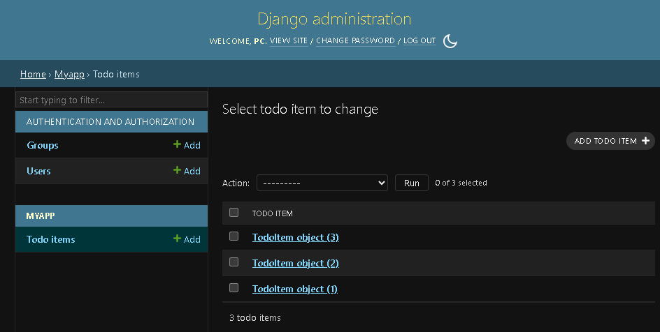
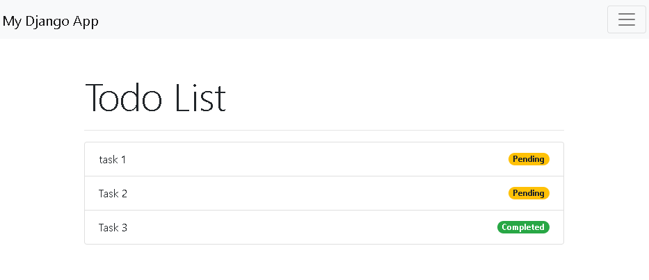

### python manage.py makemigrations
You need to run this anytime you make changes to you DB models

### python manage.py migrate
This will apply the migrate & it will update the DB for you

image.png

### Creating an Admin panel
run python manage.py createsuperuser

## Steps
1. Start with a template
2. create a model
3. implement a url for the model
4. Now checkout in the Admin panel (for testing)