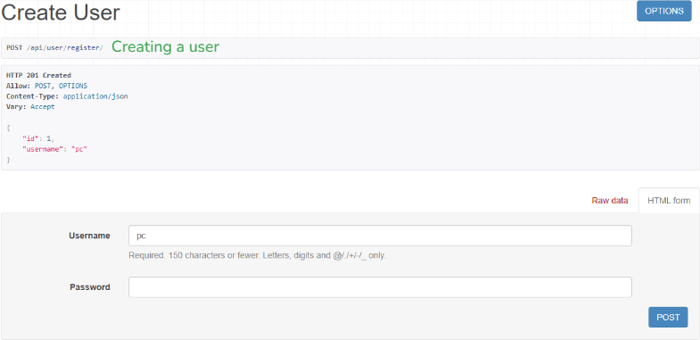
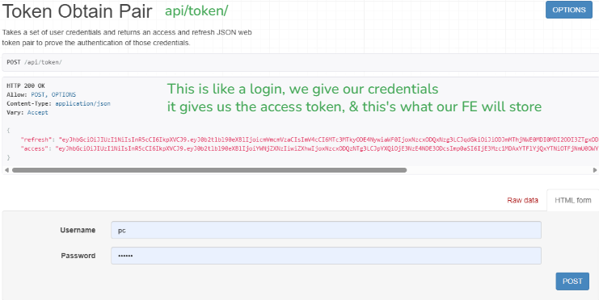
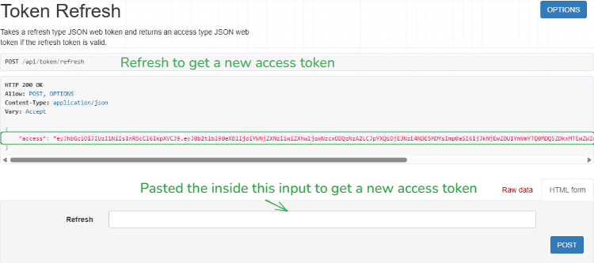

## Day 2
I've understood how the Django Rest APIs work, from setting up to building and running.
Building a Django backend involves a specific sequence of commands and configuration changes. Here is the direct, step-by-step walkthrough.

### 1. Project Setup
   First, create an isolated environment and initialize the project.

### Create and activate virtual environment
python -m venv venv
source venv/bin/activate  # Windows: venv\Scripts\activate

### Install Django and DRF
pip install django djangorestframework django-cors-headers

### Start project and app
django-admin startproject myproject .
python manage.py startapp api
### 2. Modify Settings (settings.py)
   Add your new app and the required frameworks to the INSTALLED_APPS list.

Python
INSTALLED_APPS = [
...
'rest_framework',
'corsheaders',
'api',
]

MIDDLEWARE = [
'corsheaders.middleware.CorsMiddleware', # Put at the top
...
]

# Basic DRF and CORS config
REST_FRAMEWORK = {
'DEFAULT_PERMISSION_CLASSES': [
'rest_framework.permissions.IsAuthenticated',
]
}

CORS_ALLOWED_ORIGINS = ["http://localhost:3000"] # For frontend connection
### 3. Database & Migrations
   Sync your models to the database (even if you haven't written new ones yet, Django needs its system tables).

Bash
python manage.py makemigrations
python manage.py migrate
python manage.py createsuperuser # To access /admin
### 4. Application Workflow
   To actually serve data, follow this "inside-out" flow:

Models (models.py): Define your data structure.

Serializers (serializers.py): Create this file to convert models to JSON.

Views (views.py): Use the queryset and serializer_class logic we discussed.

URLs (urls.py): Link your view to a path.

### 5. Deployment Preparation
   Before moving to a server, you must prepare for a production environment.

Requirements: Generate your list: pip install gunicorn whitenoise then pip freeze > requirements.txt.

Security: * Set DEBUG = False.

Change SECRET_KEY to an environment variable.

Add your domain to ALLOWED_HOSTS = ['yourdomain.com'].

Static Files: Set STATIC_ROOT = BASE_DIR / "staticfiles".

### 6. Deployment
   The most common 2026 workflow uses Railway, Render, or Docker.

Basic Manual Deployment Steps:

Push to GitHub: Your host will likely pull from here.

Environment Variables: Add your SECRET_KEY and DATABASE_URL in the hosting dashboard.

Build Command: pip install -r requirements.txt && python manage.py migrate.

Start Command: gunicorn myproject.wsgi.

### For visual proofs, check out this

